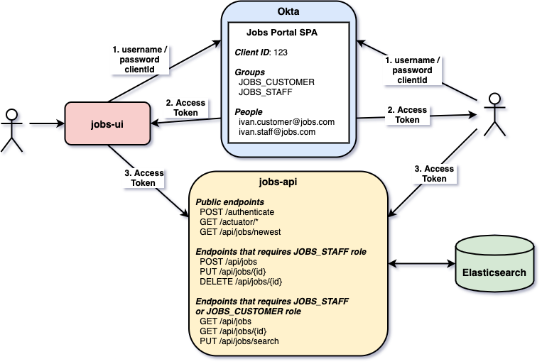

# Marketplace
 [Still under development]

The goal of this project is to implement a job marketplace application where a user can manage (create/read/update/delete) jobs. For it, we will create a backend Restful API called `jobs-api` and a frontend application called `jobs-ui`. Furthermore, we will use [`Keycloak`]) to secure the complete application.

The project previosuly used OKTA, but due to the business requirement, we have already started migrating to Keycloak, so you will see a lot of packages and naming that require cleansing and refactoring.

## Project User Interface Preview


## Project diagram



## Applications

- ### jobs-api

  [`Spring Boot`](https://docs.spring.io/spring-boot/docs/current/reference/htmlsingle/) Web Java application that exposes a REST API for managing jobs. It has some endpoints that are secured. `jobs-api` uses `Keycloak` to handle authentication and authorization.
  
 
  | Endpoint                | Secured | Role                        |
  | ----------------------- | ------- | --------------------------- |
  | `GET /actuator/*`       |      No |                             |
  | `POST /authenticate`    |      No |                             |
  | `GET /api/jobs/newest`  |      No |                             |
  | `POST /api/jobs`        |     Yes | `JOBS_STAFF`                |
  | `PUT /api/jobs/{id}`    |     Yes | `JOBS_STAFF`                |
  | `DELETE /api/jobs/{id}` |     Yes | `JOBS_STAFF`                |
  | `GET /api/jobs/{id}`    |     Yes | `JOBS_STAFF, JOBS_CUSTOMER` |
  | `PUT /api/jobs/search`  |     Yes | `JOBS_STAFF, JOBS_CUSTOMER` |

- ### jobs-ui

  [`ReactJS`](https://reactjs.org/) frontend application where customers can look for a job and staff members can handle jobs. In order to access it, a person must login. The authentication is handled by Keycloak.

## Prerequisites

- [`Java 11+`](https://www.oracle.com/java/technologies/javase-jdk11-downloads.html)
- [`npm`](https://www.npmjs.com/get-npm)
- [`Docker`](https://www.docker.com/)
- [`Docker-Compose`](https://docs.docker.com/compose/install/)


### PKCE
As Keycloak supports PKCE (Proof Key for Code Exchange) since version 7.0.0, we are using it in this project.


## Start environment

- Open a terminal

  ```
  docker-compose up -d
  ```

## Running applications

- **jobs-api**

  - In a terminal, navigate to `okta-springboot-react/jobs-api` folder


  - Run the [`Maven`](https://maven.apache.org/) command below to start `jobs-api`
    ```
    ./mvnw clean spring-boot:run
    ```

- **jobs-ui**

  - Open a new terminal and navigate to `okta-springboot-react/jobs-ui` folder


  - If you are running `jobs-ui` for the first time, execute the [`npm`](https://www.npmjs.com/) command below
    ```
    npm install
    ```

  - To start `jobs-api` run
    ```
    npm start
    ```
    It will open `job-ui` in a browser automatically.

## Applications URLs

| Application | URL                                   |
| ----------- | ------------------------------------- |
| jobs-api    | http://localhost:8080/swagger-ui.html |
| jobs-ui     | http://localhost:3000                 |

## Using jobs-ui

- Open a browser and access http://localhost:3000

- Click `Login` in the navigation bar

- Done!

> **Note:** If you are using the person `luigi.bros@jobs.com`, you will not be able to create/update/delete a job because it doesn't have the required role for it.

## Getting Access Token

In order to use just the `jobs-api` endpoints, you must have an access token. Below are the steps to get it.


## Calling jobs-api endpoints using curl

- **`GET api/jobs/newest`**

  The `api/jobs/newest` endpoint is public, so we can access it without any problem.
  ```
  curl -i http://localhost:8080/api/jobs/newest?number=2
  ```
  It should return
  ```
  HTTP/1.1 200
  [{"id":"uuulE2sBTYouQKNL1uoV", ...},{"id":"u-ulE2sBTYouQKNL1-qb", ...}]
  ```

- **`GET api/jobs` without Access Token**

  Try to get the list of jobs without informing the access token.
  ```
  curl -i http://localhost:8080/api/jobs
  ```
  It should return
  ```
  HTTP/1.1 401
  ```

- **`GET api/jobs` with Access Token**

  First, get the access token as explained in [`Getting Access Token`](#getting-access-token) section. Then, create an environment variable for the access token.
  ```
  ACCESS_TOKEN=...
  ```
  
  Call the get the list of jobs informing the access token
  ```
  curl -i http://localhost:8080/api/jobs -H "Authorization: Bearer $ACCESS_TOKEN"
  ```
  Response
  ```
  HTTP/1.1 200
  {"content":[{"id":"uISqEWsBpDcNLtN2kZv3","title":"Expert Java Developer - Cloud","company":"Microsoft","logoUrl"...}
  ```

## Using jobs-api with Swagger


- Open `jobs-api` Swagger website http://localhost:8080/swagger-ui.html

- Click `Authorize` button. Paste the access token in the `Value` field. Then, click `Authorize` and `Close` to finalize.

- Done! You can now access the sensitive endpoints.

> **Note:** If you are using the person `luigi.bros@jobs.com`, you will not be able to create/update/delete a job because it doesn't have the required role for it.

## Shutdown

- Go to the terminals where `jobs-api` and `jobs-ui` are running and press `Ctrl+C`

- To stop and remove containers, network and volumes, run in a terminal the following command inside `okta-springboot-react` root folder
  ```
  docker-compose down -v
  ```

## How to upgrade jobs-ui dependencies to latest version

- In a terminal, make sure you are in `okta-springboot-react/movies-ui` folder

- Run the following commands
  ```
  npm i -g npm-check-updates
  ncu -u
  npm install
  ```

## References

- https://www.npmjs.com/package/@okta/okta-react
- https://developer.okta.com/code/react/okta_react_sign-in_widget/
- https://developer.okta.com/blog/2019/03/06/simple-user-authentication-in-react
- https://dzone.com/articles/23-useful-elasticsearch-example-queries
